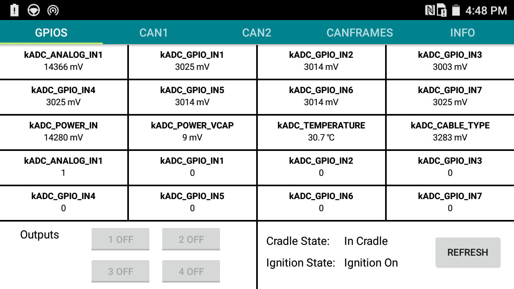
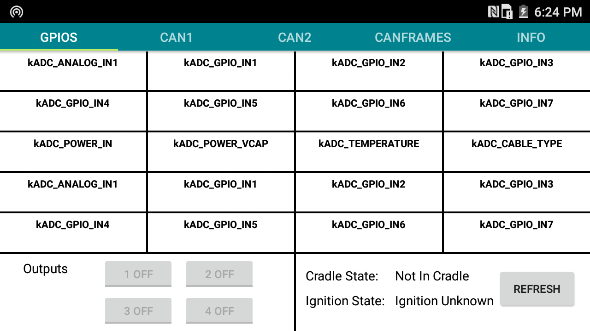
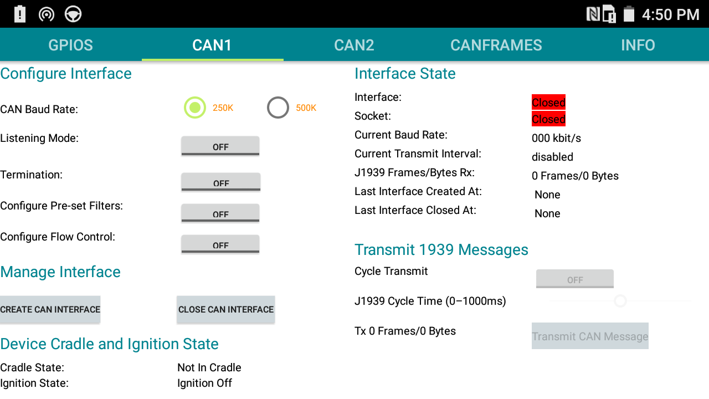
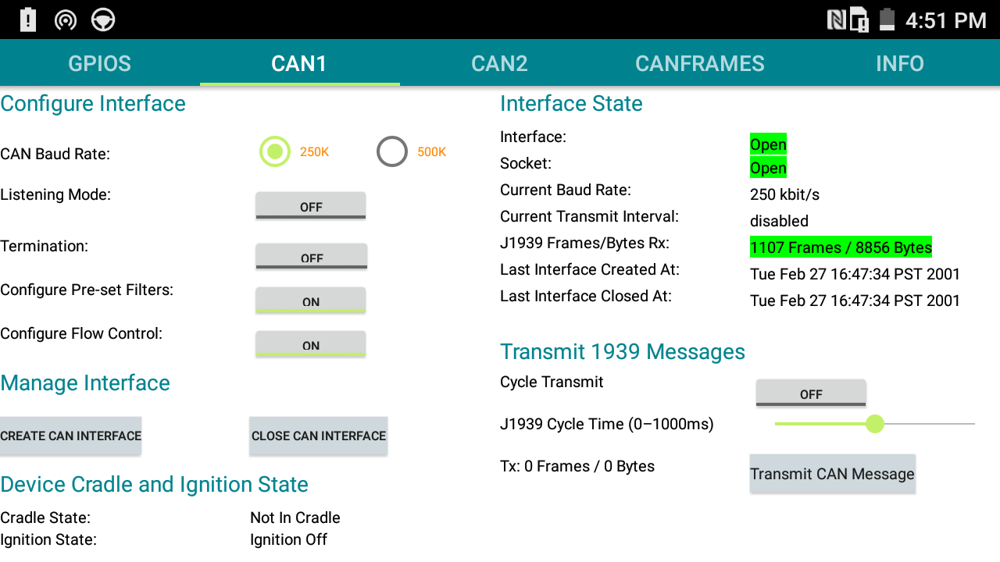
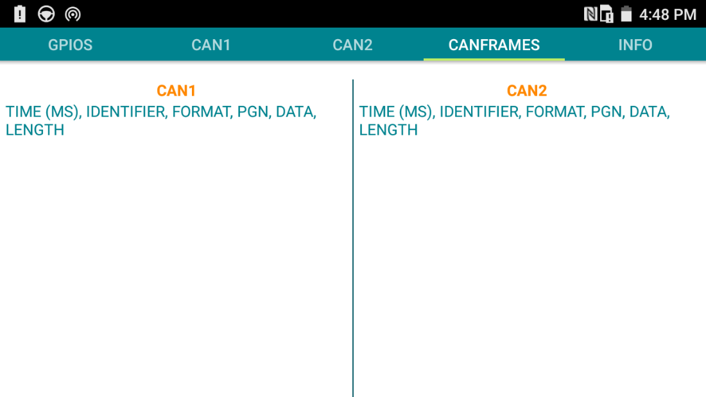
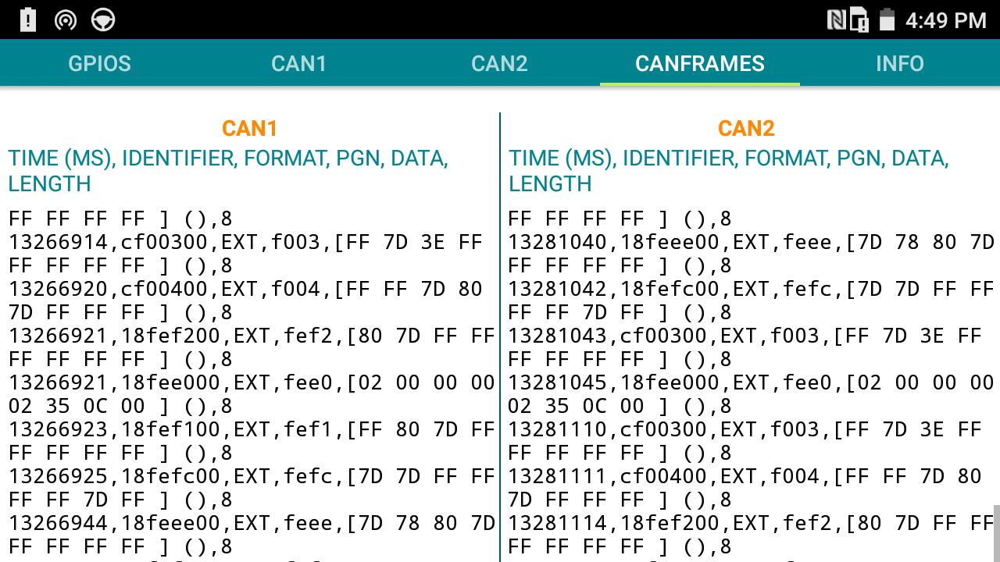
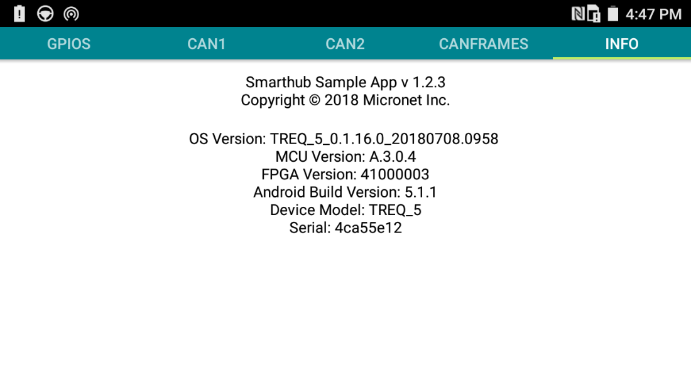
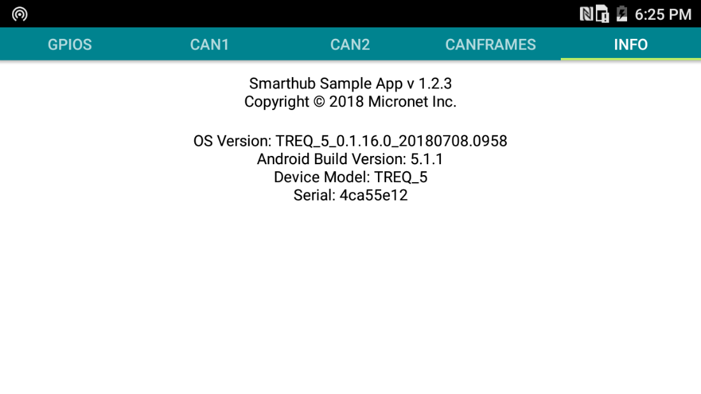
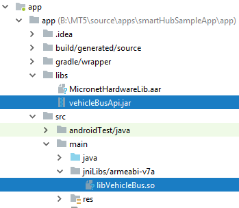

# SmartTab/SmartHub Sample App 
|Products|SmartHub/Smart Cradle with MT5|
|--------|------------------------------|
|Project|SmartTab/SmartHub Sample App|
|Project Name |SmartTab/SmartHub Sample App |
|Aim/Objectives |To document an Android sample application that shows application developers how to use the Hardware Library and Vehicle Bus Library with the Smart Cradle and SmartHub. |
|Current Application Version |V1.2.4 |
|Document Revision Number |03 |
|Document Revision Date |17th July 2018 |

## Documentation History 
|Document Revision |Written By |Date |Comments |
|------------------|-----------|-----|---------|
|01 |Abid Esmail  |14 June 2018 |Draft |
|02 |Scott Krstyen |13 July 2018 |Added UI section, Hardware Library Section and Important Points to discuss |
|03 |Abid Esmail and Scott Krstyen |17 July 2018 |Added CAN bus section, background information and |


## Preface
### Document Purpose 
The purpose of this document is to explain the functionality of the SmartTab/SmartHub Sample App and how to use the Micronet Hardware Library and the Vehicle Bus Library in an Android application. For more detailed information on either of the libraries, refer to their Javadocs.  


## Introduction
### Background Information 

This application was created as an example of how to use the Micronet Hardware Library and the Vehicle Bus Library on the Smart Cradle with MT5 and the SmartHub.

It has been built with Android Studio v3.1.3 and tested on: 
* OS: TREQ_5_0.1.16.0_20180708.0958 
* MCU Firmware: A.3.2.0 
* FPGA: 41000003 

### Application Features 
Below are the application features of the sample app: 

#### GPIO and ADCs polling 
Reading the GPIO’s state and ADC voltages using the Micronet Hardware Library. 

#### CAN Port Configuration and Packet handling 
Configuring the CAN ports baud rate, filters, flow control and termination. Sending and receiving CAN bus messages using the Vehicle Bus Library.  


#### Version Information 
Read device information such as the OS version, MCU version, FPGA version and serial number.  

#### Dock and Undock handling and USB event processing 
Create a broadcast receiver for dock and undock events and display it on the UI. Handle USB events that indicate loss of communication from the MCU. 

#### Future Features 
General purpose outputs (GPO) control, sending and receiving J1708 messages. 


## User Interface
### Graphical User Interface
The graphical user interface is tabbed with a standard Android header. 

### GPIO tab
##### In Cradle

##### Out of Cradle


### CAN bus 1 tab
##### Closed Can Interface

##### Opened Can Interface and Receiving Messages


### CAN bus 2 tab
##### Same as CAN bus 1 tab

### CAN bus frames tab
##### Not Receiving Messages 


##### Receiving Messages


### J1708 tab
##### Not Currently Implemented

### Info tab
##### In Cradle

##### Out of Cradle



## Device Docking and USB events
### Device State Receiver 
The app uses the Device State Receiver to receive dock events, USB attachment, and USB detachment broadcasts through an intent filter. The three broadcasts it receives are: 
* Intent.ACTION_DOCK_EVENT 
* UsbManager.ACTION_USB_DEVICE_ATTACHED 
* UsbManager.ACTION_USB_DEVICE_DETACHED 

More on dock events can be found here:  
https://developer.android.com/training/monitoring-device-state/docking-monitoring. 

Once it receives a broadcast it uses the LocalBroadcastManager to send a local broadcast to the app with the action that has occurred. Using the LocalBroadcastManager each fragment can register to receive the local broadcasts and then handle dock events and USB events as needed for that specific fragment. LocalBroadcasts are more efficient because they do not require inter-process communication since they are only sent to your app. 

More on Local Broadcasts:  

https://developer.android.com/reference/android/support/v4/content/LocalBroadcastManager. 

The Micronet Hardware Library should not be used until at least 2 seconds after the UsbManager.ACTION_USB_DEVICE_ATTACHED broadcast has been received. If it is used too quickly then it can fail to receive information back from the device because the underlying driver needs to get initialized and can take up 2 seconds to initialize after the USB ports are available 

The TTY ports can be used immediately after the UsbManager.ACTION_USB_DEVICE_ATTACHED broadcast is received. In this app that broadcast is received and then the CAN bus interface can be opened.  

### Handling configuration changes during dock events 
When the device is docked and undocked, its configuration state changes. This causes the application to restart with the new configuration changes.  

As detailed here: https://developer.android.com/guide/topics/resources/runtime-changes, there are two ways that you can handle the configuration change. One is to retain an object during the configuration change and the other is to handle the configuration change yourself.  

## Micronet Hardware Library 
The Micronet Hardware Interface is used to get information from the device such as the GPIOs state and voltage and other info about the device. For more detailed information about the library, refer to the Javadocs. 

### Importing the Micronet Hardware Library
To import the library: 
* Add the .aar file to the "libs" folder inside of the "app" folder of your project.  

* In the app's build.gradle file, in the lower "dependencies" block outside of the "android" block, add the following lines:
    * implementation files('libs/MicronetHardwareLib.aar')
    * implementation fileTree(dir: 'libs',include: ['*.jar', '*.aar', "*.so"])

``` java
dependencies { 
    implementation files('libs/vehicleBusApi.jar') 
    implementation files('libs/MicronetHardwareLib.aar') 
    implementation fileTree(dir: 'libs',include: ['*.jar', '*.aar', "*.so"]) 
    implementation 'com.android.support:appcompat-v7:27.1.1' 
    implementation 'com.android.support.constraint:constraint-layout:1.1.2' 
    implementation 'com.android.support:support-v4:27.1.1' 
    testImplementation 'junit:junit:4.12' 
    androidTestImplementation 'com.android.support.test:runner:1.0.2' 
    androidTestImplementation 'com.android.support.test.espresso:espresso-core:3.0.2' 
} 
```
### How to get an instance of the Micronet Hardware Library 
Use “MicronetHardware.getInstance()” to get a Micronet Hardware object.  
``` java
MicronetHardware micronetHardware = MicronetHardware.getInstance();
```
From there, use that object to call available methods. 
``` java
try{ 
    String mcuVersion = micronetHardware.getMcuVersion(); 
    String fpgaVersion = micronetHardware.getFpgaVersion(); 
} catch (MicronetHardwareException e) { 
    Log.e(TAG, e.toString()); 
} 
```

### Available fields 

Name |Description 
|---|---|
kADC_ANALOG_IN1 |Constant describing ignition. 
kADC_CABLE_TYPE |Constant describing cable type. 
kADC_GPIO_IN1 |Constant describing GPIO input 1. 
kADC_GPIO_IN2 |Constant describing GPIO input 2. 
kADC_GPIO_IN3 |Constant describing GPIO input 3. 
kADC_GPIO_IN4 |Constant describing GPIO input 4. 
kADC_GPIO_IN5 |Constant describing GPIO input 5. 
kADC_GPIO_IN6 |Constant describing GPIO input 6. 
kADC_GPIO_IN7 |Constant describing GPIO input 7. 
kADC_POWER_IN |Constant describing battery voltage. 
kADC_POWER_VCAP |Constant describing the super cap. 
kADC_TEMPERATURE |Constant describing the temperature sensor. 
TYPE_IGNITION |Same as kADC_ANALOG_IN1 

### How to get the Input Voltage and State 
To get the input voltage you can use the getAnalogInput() or getAllAnalogInput(): 
``` java
int analog_in1 = micronetHardware.getAnalogInput(MicronetHardware.kADC_ANALOG_IN1); 
int gpio_in1 = micronetHardware.getAnalogInput(MicronetHardware.kADC_GPIO_IN1); 
int gpio_in2 = micronetHardware.getAnalogInput(MicronetHardware.kADC_GPIO_IN2); 
int gpio_in3 = micronetHardware.getAnalogInput(MicronetHardware.kADC_GPIO_IN3); 
int gpio_in4 = micronetHardware.getAnalogInput(MicronetHardware.kADC_GPIO_IN4); 
int gpio_in5 = micronetHardware.getAnalogInput(MicronetHardware.kADC_GPIO_IN5); 
int gpio_in6 = micronetHardware.getAnalogInput(MicronetHardware.kADC_GPIO_IN6); 
int gpio_in7 = micronetHardware.getAnalogInput(MicronetHardware.kADC_GPIO_IN7); 
int power_in = micronetHardware.getAnalogInput(MicronetHardware.kADC_POWER_IN); 
int power_vcap = micronetHardware.getAnalogInput(MicronetHardware.kADC_POWER_VCAP); 
int temperature = micronetHardware.getAnalogInput(MicronetHardware.kADC_TEMPERATURE); 
int cable_type = micronetHardware.getAnalogInput(MicronetHardware.kADC_CABLE_TYPE); 

int[] analogInputs = micronetHardware.getAllAnalogInput(); 
```

A value of –1 is returned if the device cannot communicate with the MCU. Check Javadoc for other details. 

To get the input state you can use getInputState() or getAllPinInState(): 
``` java
int analog_in1 = micronetHardware.getInputState(MicronetHardware.kADC_ANALOG_IN1); 
int gpio_in1 = micronetHardware.getInputState(MicronetHardware.kADC_GPIO_IN1); 
int gpio_in2 = micronetHardware.getInputState(MicronetHardware.kADC_GPIO_IN2); 
int gpio_in3 = micronetHardware.getInputState(MicronetHardware.kADC_GPIO_IN3); 
int gpio_in4 = micronetHardware.getInputState(MicronetHardware.kADC_GPIO_IN4); 
int gpio_in5 = micronetHardware.getInputState(MicronetHardware.kADC_GPIO_IN5); 
int gpio_in6 = micronetHardware.getInputState(MicronetHardware.kADC_GPIO_IN6); 
int gpio_in7 = micronetHardware.getInputState(MicronetHardware.kADC_GPIO_IN7); 
 
int[] inputStates = micronetHardware.getAllPinInState(); 
```

### How to get the MCU and FPGA versions 
To get the MCU version use getMcuVersion() and to get the FPGA version use getFpgaVersion().  
``` java
try{ 
    String mcuVersion = micronetHardware.getMcuVersion(); 
    String fpgaVersion = micronetHardware.getFpgaVersion(); 
} catch (MicronetHardwareException e) { 
    Log.e(TAG, e.toString()); 
} 
```

### Handling Micronet Hardware Exceptions 
Some methods from the Micronet Hardware Library throw a MicronetHardwareException when they are not able to receive information from the device such as when the MT5 is undocked from the smart cradle. If the method throws a MicronetHardwareException simply use a try-catch block to catch the exception and handle it if the device is undocked. 
``` java
try{ 
    String mcuVersion = micronetHardware.getMcuVersion(); 
    String fpgaVersion = micronetHardware.getFpgaVersion(); 
    String rtcDateTime = micronetHardware.getRtcDateTime(); 
} catch (MicronetHardwareException e) { 
    Log.d(TAG, "Couldn't retrieve device information at this time."); 
} 
```
Look at Javadoc for more information on if a function throws an exception or returns a different value if it cannot be retrieved. 

## Vehicle Bus Library
The vehicle bus library is used to communicate to the following busses via the smart cradle: 
* CAN1 Port 
* CAN2 port 
* J1708 (TODO: Sample application has not yet been created) 

In this application we discuss the following: 
* Adding the Vehicle bus library to an Android application 
* Setting up a CAN interface 
* Sending and Receiving frames to the CAN ports 
* Handling Vehicle Bus exceptions 
* Handling USB port changes from the Smart cradle 

To get detailed information on the Vehicle Bus library, please refer to the Vehicle Bus library Java documentation. 

### Adding the Vehicle Bus Library to the Android App 
To import the library, add the vehicleBusApi.jar file to the ‘app\libs\ folder’ and the libVehiclebus.so file to the ‘app\src\main\jniLibs\armeabi-v7a’ folder (as shown in the image below). You will need to create the folder jniLibs/armeabi-v7a.  

Note: These instructions are for the 32 bit version of the library 



For Android Studio to detect the library files, please the following to the application gradle file:
* abiFilters "armeabi", "armeabi-v7a", "x86", "mips"
* implementation files('libs/vehicleBusApi.jar')
* implementation fileTree(dir: 'libs',include: ['*.jar', '*.aar', "*.so"])

```java
android { 
    compileSdkVersion 27 
    buildToolsVersion '27.0.3' 
    defaultConfig { 
        applicationId "com.micronet.smarttabsmarthubsampleapp" 
        minSdkVersion 22 
        targetSdkVersion 27 
        versionCode 1 
        versionName "1.2.4" 
        testInstrumentationRunner "android.support.test.runner.AndroidJUnitRunner" 
        ndk{ 
            abiFilters "armeabi", "armeabi-v7a", "x86", "mips" 
        } 
    } 

} 
```
``` java
dependencies { 
    implementation files('libs/vehicleBusApi.jar') 
    implementation files('libs/MicronetHardwareLib.aar') 
    implementation fileTree(dir: 'libs',include: ['*.jar', '*.aar', "*.so"]) 
    implementation 'com.android.support:appcompat-v7:27.1.1' 
    implementation 'com.android.support.constraint:constraint-layout:1.1.2' 
    implementation 'com.android.support:support-v4:27.1.1' 
    testImplementation 'junit:junit:4.12' 
    androidTestImplementation 'com.android.support.test:runner:1.0.2' 
    androidTestImplementation 'com.android.support.test.espresso:espresso-core:3.0.2' 
} 
```

### Setting up a CAN Interface
There are multiple methods available to create an interface. We will discuss the creation of an interface with filters and flow control. To create a new CAN interface, we need to first create a new CanbusInterface() object. We then need to pass in the arguments to the create method. In this example we are creating an interface to CAN1 (portNumber = 2). 
``` java
private CanbusInterface canBusInterface1; 
private CanbusHardwareFilter[] canBusFilter; 
private CanbusFlowControl[] canBusFlowControls; 
private CanbusSocket canBusSocket1; 
int portNumber = 2; 

if (canBusInterface1 == null) { 
    canBusInterface1 = new CanbusInterface(); 
    canBusFilter = setFilters(); 
    canBusFlowControls = setFlowControlMessages(); 
    try { 
        canBusInterface1.create(silentMode, baudRate, termination, canBusFilter, portNumber, canBusFlowControls); 
    } catch (CanbusException e) { 
        Log.e(TAG, e.getMessage() + ", errorCode = " + e.getErrorCode()); 
        e.printStackTrace(); 
        return -1; 
    } 
} 
 
if (canBusSocket1 == null) { 
    canBusSocket1 = canBusInterface1.createSocketCAN1(); 
    canBusSocket1.openCan1(); 
} 
if (discardInBuffer) { 
    canBusSocket1.discardInBuffer(); 
} 
isCan1InterfaceOpen = true; 
startPort1Threads(); 
return 0; 
```
It is important to check for any CanbusExceptions that occur when creating the interface. If the interface is created successfully, we can create a socket to CAN1, discard the old buffer and create a thread for reading the CAN bus frames. 

 

Below we describe the filter and flow control arguments of the create interface:  
#### Filters 
Filters are used to only allow certain messages to come through on the CAN bus. To see an example of setting up filters, take a look at setFilters() in the CanTest.java class. Filters are defined as an array of CanbusHardwareFilter[]. Each filter contains a filter type, an ID to search for and mask. The smart cradle does not allow any messages through if no filter is provided. To allow all messages through, the user can set a standard and extended ID and mask of 0x0, as shown below: 

``` java
ArrayList<CanbusHardwareFilter> filterList = new ArrayList<>(); 
CanbusHardwareFilter[] filters; 
int[] ids; 
int[] masks; 
int[] types; 

ids = new int[]{0x00000000, 0x00000000}; 
masks = new int[]{0x00000000, 0x00000000}; 
types = new int[]{CanbusHardwareFilter.STANDARD, CanbusHardwareFilter.EXTENDED}; 

filterList.add(new CanbusHardwareFilter(ids, masks, types)); 
filters = filterList.toArray(new CanbusHardwareFilter[0]); 
```
 
NOTE: Users are required to pass a filters list to the create interface. The filter list cannot be null 

#### Flow Control 
Flow control is used to send a message response automatically on the CAN bus by the MCU firmware. This is useful when user needs to send responses to messages very quickly on the CAN bus. Flow control message requests have the first byte as 0x10. To see an example, take a look at the setFlowControlMessages() in the CanTest.java class. 
``` java
byte[] responseData=new byte[]{0x10,0x34,0x56,0x78,0x1f,0x2f,0x3f,0x4f}; 
CanbusFlowControl[] flowControlMessages = new CanbusFlowControl[1]; 

flowControlMessages[0] = new CanbusFlowControl(0x18FEE000,0x18FEE018,CanbusFlowControl.EXTENDED,8,responseData); 
```

In the example above, if a message is received with ID 0x18FEE000 and the data byte 0 is 0x10, the MCU will respond with ID 0x18FEE000 and data bytes {0x10,0x34,0x56,0x78,0x1f,0x2f,0x3f,0x4f} 

### Sending and Receiving frames to the CAN ports 
#### Sending Frames 
We send frames by creating a J1939Port1Writter Runnable. In the runnable we create a new CanbusFramePort1 object with the messageId, messageData and messageType. We then write the frame to the port using canBusSocket1.write1939Port1(canFrame). In the example application we are writing the same frame every time. 
``` java
CanbusFramePort1 canFrame = new CanbusFramePort1(MessageId, MessageData, MessageType); 
canBusSocket1.write1939Port1(canFrame); 
```

#### Receiving Frames 
We receive frames by creating a J1939Port1Reader Runnable. In the runnable we have two options, we can either read the port continuously or we can provide a read timeout.
``` java
private volatile boolean blockOnReadPort1 = false; 
CanbusFramePort1 canBusFrame1; 

if (blockOnReadPort1) { 
    canBusFrame1 = canBusSocket1.readPort1(); 
} else { 
    canBusFrame1 = canBusSocket1.readPort1(READ_TIMEOUT); 
} 
```
Once we receive a frame, we parse the frame and write it to the CANFrame fragment text UI. Example code can be seen in the CanTest.java class.

### Handling Vehicle Bus exceptions 
When opening an interface, it is important to handle the Vehicle bus exceptions as shown below. If the device is not docked, the Canbus library will not be able to communicate with the MCU and will return a vehicle bus exception with are error code -1. 
``` java
if (canBusInterface1 == null) { 
    canBusInterface1 = new CanbusInterface(); 
    canBusFilter = setFilters(); 
    canBusFlowControls = setFlowControlMessages(); 
    try { 
        canBusInterface1.create(silentMode, baudRate, termination, canBusFilter, portNumber, canBusFlowControls); 
    } catch (CanbusException e) { 
        Log.e(TAG, e.getMessage() + ", errorCode = " + e.getErrorCode()); 
        e.printStackTrace(); 
        return -1; 
    } 
} 
```

### Handling USB port changes when the USB ports are detached  
When the MT5 is undocked from the smart cradle, the application will need to close out the CAN interface and reopen it when it is docked back into the cradle 

Each Can Overview fragments registers for a local broadcast (described in section ‘Device Docking and USB events’) shown below: 
``` java
IntentFilter filters = new IntentFilter(); 
filters.addAction("com.micronet.smarttabsmarthubsampleapp.dockevent"); 
filters.addAction("com.micronet.smarttabsmarthubsampleapp.portsattached"); 
filters.addAction("com.micronet.smarttabsmarthubsampleapp.portsdetached"); 
```

If the CAN interface is Open and the fragment gets a portdetached event, the state of the CAN interface is remembered and when the portattached event is received, the fragment reopens the CAN interface with the stored configuration.  
``` java
private final BroadcastReceiver broadcastReceiver = new BroadcastReceiver() { 
    @Override 
    public void onReceive(Context context, Intent intent) { 
        goAsync(); 
 
        String action = intent.getAction(); 
 
        if (action != null) { 
            switch (action) { 
                case "com.micronet.smarttabsmarthubsampleapp.portsattached": 
                    if (reopenCANOnTtyAttachEvent){ 
                        openCan1Interface(); 
                        reopenCANOnTtyAttachEvent = false; 
                    } 
                    Log.d(TAG, "Ports attached event received"); 
                    break; 
                case "com.micronet.smarttabsmarthubsampleapp.portsdetached": 
                    if (canTest.isCan1InterfaceOpen()){ 
                        closeCan1Interface(); 
                        reopenCANOnTtyAttachEvent = true; 
                    } 
                    Log.d(TAG, "Ports detached event received"); 
                    break; 
            } 
        } 
    } 
}; 
```
Note: When the MT5 is undocked the Cradle MCU automatically closes the CAN ports out to avoid anything being sent on the CAN bus when the cradle is in a standby state. 
